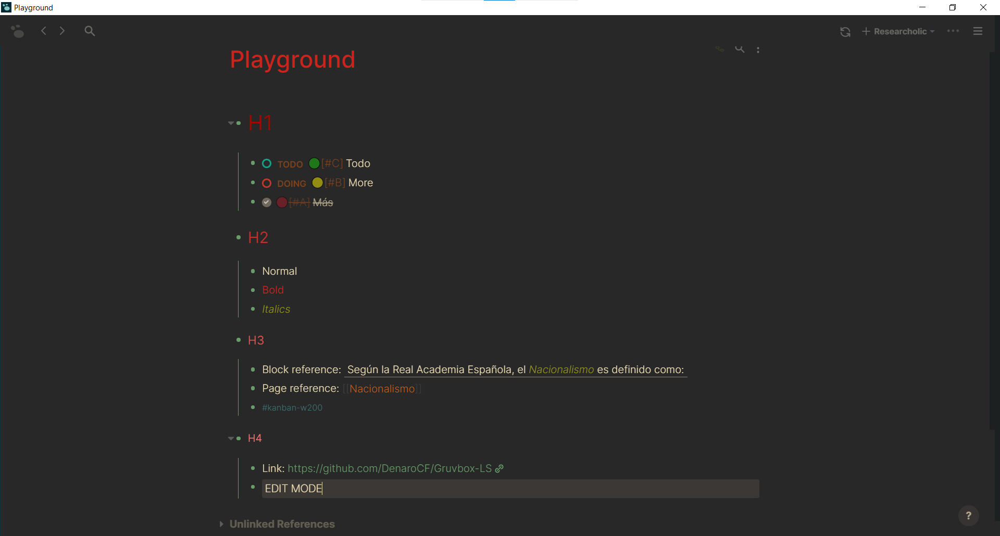
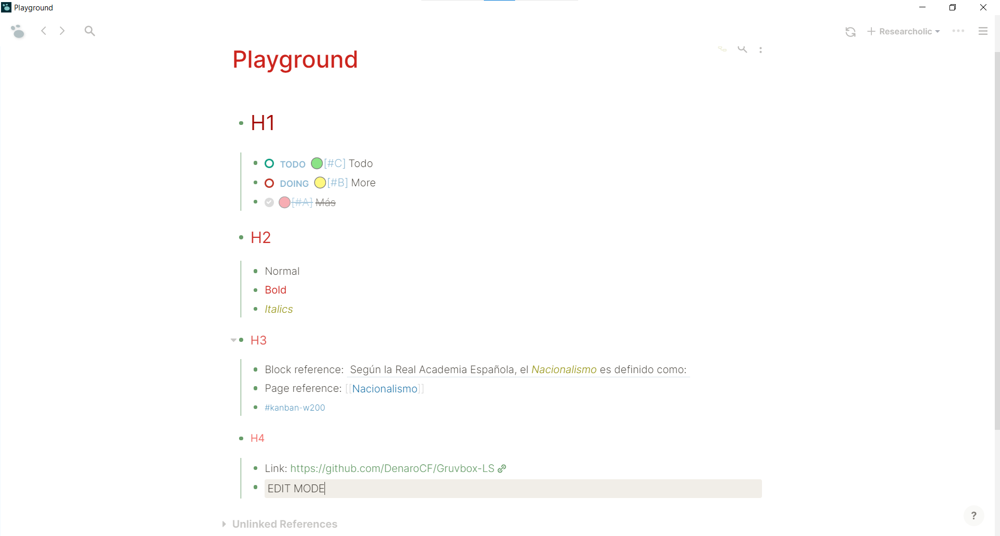

# Gruvbox-LS
[Bryan Jenks'](https://twitter.com/tallguyjenks) Gruvbox theme edited by me [(Denaro)](https://twitter.com/DenaroCascio)

**_You can find how to install the theme at the end of the text._**

## Dark Mode

## Light Mode

## Installation

- Clone the repo
- Open the _plugin_ option in Logseq Desktop Client
- Select **Load unpacked plugin** in Logseq Desktop client
- Open the folder of the repo.
- Choose the theme
